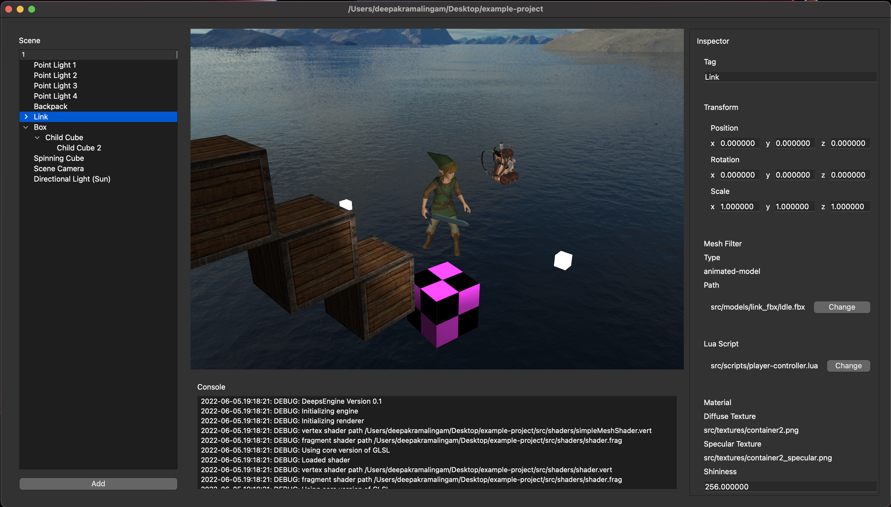

# DeepsEngine

## Author

Deepak Ramalingam

## About

Modern 3D game engine created with OpenGL, GLFW, C++, Entt, Lua, Sol2, Assimp, Emscripten, and Qt 5



## Get Started (Development)

- It is recommended to clone this repository recursively with submodules

```shell
git clone --recurse-submodules -j8 https://github.com/rdeepak2002/DeepsEngine.git
```

### Install Requirements:

```shell
sudo chmod 777 setup.sh
./setup.sh
```

### Run the Engine in Desktop Release or Desktop Editor mode
- Open 'DeepsEngine' folder in CLion
  - Enable autoreload for CMake changes
- Run the CMake application in either Editor or Release mode (if you encounter errors, you might have to reload the CMake profiles)

If you want to run the engine in editor mode without CLion, you must assign any value to an environment variable called "WITH_EDITOR". Then, build the CMake project using the CMakeLists.txt

## Troubleshooting (Development)

If you are receiving errors while installing new vcpkg packages, please delete the vcpkg folder in root and reinstall everything.

```shell
sudo chmod 777 setup.sh
rm -rf vcpkg
./setup.sh
```

If you are having issues loading the web export, make sure to delete all files cached (chrome://settings/clearBrowserData)
